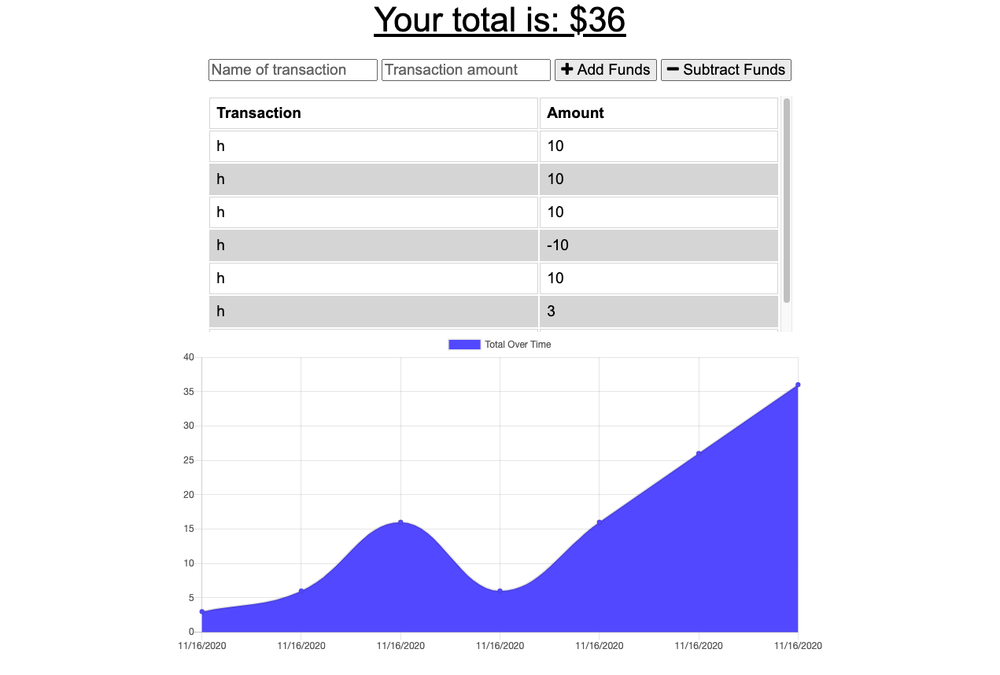

# PWA BUDGET TRACKER

## Table of Contents
* Description
* User Story
* Demo Link
* Screenshot
* Technology
* Sources
* Additional Questions   

## Description 
The user will be able to add expenses and deposits to their budget with or without a connection. When entering transactions offline, they should populate the total when brought back online.

Offline Functionality:

  * Enter deposits offline
  * Enter expenses offline

When brought back online:

  * Offline entries should be added to tracker.

## User Story

* As an avid traveller I want to be able to track my withdrawals and deposits with or without a data/internet connection so that my account balance is accurate when I am traveling.

## Demo Links 
[Heroku](https://desolate-forest-31854.herokuapp.com/)

[Github](https://github.com/jkwagneriii/PWA_Budget_Tracker)

## Screenshot

## Technology
Mongo, Mongoose, Github, Node, JQuery, Express, Atlas, Heroku, HTML, CSS etc.

## Sources

* [Service Worker Docs](https://developers.google.com/web/fundamentals/primers/service-workers)

## Additional Questions
If you have any questions about the project, please reach out to [Jake Wagner](https://github.com/jkwagneriii) through GitHub.